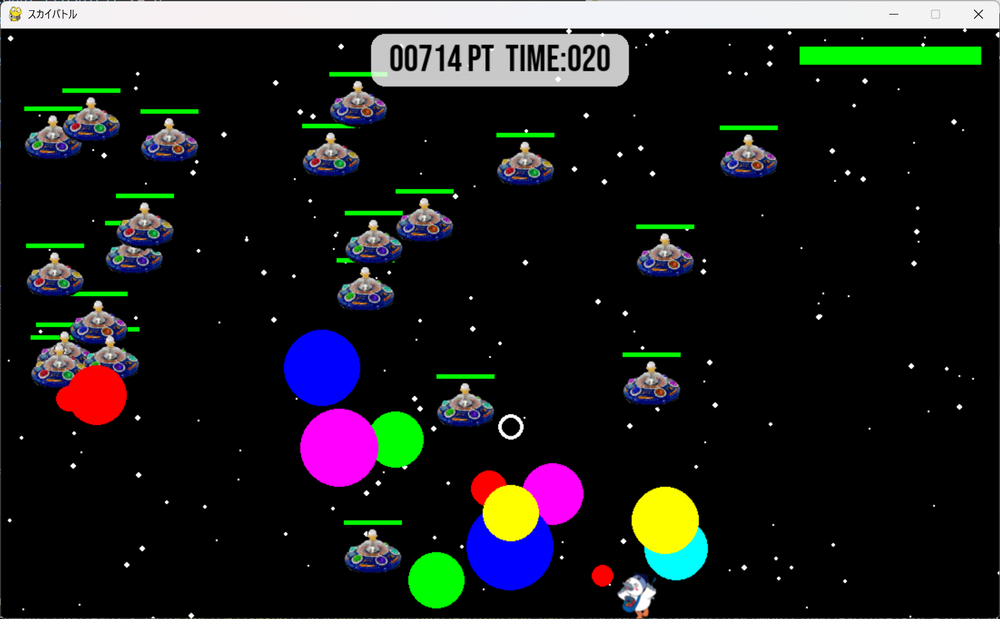

# スカイバトル

## 実行環境の必要条件
* python >= 3.10
* pygame >= 2.1
* マウス

## ゲームの概要
* 主人公キャラクター（コウカトン）をWASD操作を用いて敵を倒してポイントをためていくゲーム。
* 敵の球をよけながら撃墜をしてハイスコアを狙うゲーム。
* 参考URL：[本講義Moodle](https://service.cloud.teu.ac.jp/moodle_epyc/course/view.php?id=18633)

## ゲームの遊び方
1. 操作方法
    - 移動：WASDキー - 射撃：マウスクリック（左クリックで攻撃）
    - 回避行動："F"キー - 必殺技タイミングゲーム：スペースキー
2. ポイントを稼ごう！
    - 敵や敵の弾を撃ち落としてスコアを稼ぎましょう。
    - 特定の条件を満たすと「タイミングゲーム」が発生します。スペースキーを使ってタイミングよく操作し、大ダメージを与えるチャンスです。
3. 敵の攻撃を避ける 
    - 撃ち落とせない爆弾も存在します。回避行動を活用して、ダメージを受けないようにしましょう。
4. ゲームオーバー
    - こうかとんのHPが尽きるとゲームオーバーです。

## ゲームの実装
### 共通基本機能
* 宇宙っぽい背景画像とこうかとん、敵キャラクターの描画。
* Wキー、Aキー、Sキー、Dキーでこうかとんを操作。
* マウスカーソルを狙って射撃可能。
* 敵キャラクターがこうかとんを狙って攻撃。
* 敵や攻撃を撃破すると爆発エフェクトが表示。

### 分担追加機能
* **宇宙っぽい背景（担当：仙波）**：背景として大きさの様々な星の背景を作成する機能。
* **必殺技カーソル（担当：仙波）**：タイミングよくスペースキーを押すと周辺にいる敵を倒す機能。
* **スタート画面（担当：仙波）**:ルール説明を掲載し背景画像を変更可能なスタート画面を表示する機能。
* **ゲームオーバー画面（担当：仙波）**:ゲームオーバーを表示しゲームを再起動できる機能。
* **HPゲージ（担当：西ヶ谷）**：こうかとんと敵のHPをゲージで表示して残りHPに応じてゲージの色を変化させる機能。
* **回避(担当:服部)**:回避行動中に無敵状態になる機能。
* **マウスカーソルに向かって射撃(担当:服部)**:マウスカーソルに向かって射撃する機能。
* **爆弾区別（担当：小田）**：ビームで倒せる爆弾と倒せない爆弾の識別を行う機能。

### ToDo
- [ ] カメラ機能、主人公キャラクターを中心にする
- [ ] スタート画面で必殺技カーソルの練習を選択可能にする
- [ ] ステージ機能
- [ ] アイテム要素
- [ ] ボーナス

### メモ
* bombクラスの引数を追加した。
